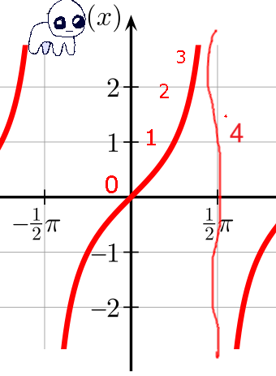

## Infinite Gremlin Resonant Theorem
When two gremlins meet, there is a chance for the energy to bounce off of each other in a resonant feedback loop. The gremlin energy in the system rapidly rises, and with no hope for entropy to keep up, a theoretical Infinite Gremlin event may occur.  
  

0. Theoretical null point. No gremlin activity is occurring.  
1. Gremlins have met, the gremlin energy resonates into a feedback look and the gremlin energy in the system rises.  tbh_bounces loops faster and faster.  
2. Feedback loop causes gremlin energy to rise exponentially. tbh_bounces achieves hypervelocity.  
3. The event horizon: Gremlin energy approaches infinity. tbh_bounces approaches the speed of light.  
4. The gremlin singularity. Gremlin energy reaches infinity. With nowhere for infinite energy in the system to dissapate, tbh_bounces exceeds the speed of light. With FTL signaling violated, the laws of physics shatter. Laws of conservation of mass and conservation of energy fall apart. The fundamental interactions are destroyed. At the asymtote, all space between negative infinity and infinity are occupied. Infinite velocity has been acheived. Warp 10 occurs and all space in the universe is occupied simultaneously by tbh_bounces. All is now gremlin. The universe has become gremlin. All is gremlin energy. Entropy has been violated.
5. MultiVac reverses entropy? Universe is reborn?
  
